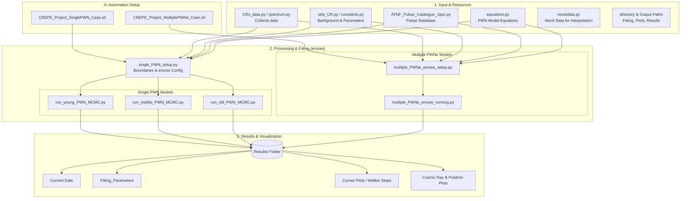

# CREPE_Docker
Cosmic Ray Electron and Positron Excess - Using PWNe [Docker version]

## Cosmic Ray Electron and Positron Excess Project ####
### PWN Plotting Python File --- Kritaporn's Research ###

## Announcement Part!


This Docker is built for running the code that is involved in the previous work:
Some Part will be adjust.

This project launch for portflio only.

--------------------------------------
I have 2 options for you to build a docker container

For Build Docker 

# Option 1: [Self adjust]

- Before running the command, please install Docker first

   - check the version of Docker

```
Docker --version
```

- Build Docker image [Self type -- feel free to name the Docker image]:

- Command:
```
docker build -t crepe/ubuntu.22 .
```

# Option 2: [Build Automation - Using Bash Script]
## Follow the Steps! [Build, Run and Access for the 1st time, and Access again next time]
- Command 1 [Build Docker]:
```
bash build-docker-command.sh
```

-------------------------------------------
# For Access into Docker

- Command 2 [Run Docker Image]:
```
bash run-docker-after-build-image.sh
```

* after access for the 1st time, please run bash script to update and upgrade before run the project's code:
```
bash run-script-Inside_Docker-firsttime.sh 
```

Note: If you want to exit from Docker, please type:
```
exit
```

-------------------------------------------
# For Access next time

- Command 3 [Access again next time [Container ID]!]:
```
bash access-docker-daily-use.sh
```

*Next, please follow the steps below to run the project's code

#Inside Docker
--------------------------
For running using bash:

- This project has two models:

    - A Single Pulsar Wind Nebula Model

- Command:
```
bash CREPE_Project_SinglePWN_Case.sh
```

Note: Don't forget to input requirements (nwalker steps, niter, processing_cpu for multiprocessing, and pulsar popoulation cases)

- The Multiple Pulsar Wind Nebulae Model:

- Command:
```
bash CREPE_Project_MultiplePWNe_Case.sh
```

Note: Don't forget to input requirements (nwalker steps, niter, and processing_cpu for multiprocessing)

-----------------------------------------

------------------
Update April 7, 2026
------------------
- Run MCMC Fiiting (the emcee Python package) by using bash command in the terminal

- Bash files will create folders for keeping Results files

- Command for Single PWN Model [Adjust python Run_{...}_PWN_MCMC.py inside ./{...}.sh first]:

```
bash CREPE_Project_SinglePWN_Case.sh
```

- Command for Multiple PWNe Model:
```
bash CREPE_Project_MultiplePWNe_Case.sh
```


-----------------------
Design Structure Code
-----------------------
- Python Package Requirements
    - pandas - Dataframe
    - matplotlib
    - os
    - numpy
    - scipy - constants, integrate, interpolate
    - astropy - fits, unit, constants
    - emcee
    - corner
    - multiprocessing - Pool
    - unittest
    - utils_CR -- Credit: PDL github

------------------------------------



------------------------------------


| Process | Filename/Folder | Description  | Note |
| :---: | :---: | :--- | :--- |
| Input | CRs_data.py | Cosmic Ray Electron and Positron data - Database CRDBs | Credit: PDL GitHub |
|  | spectrum.py | Cosmic Ray Electron and Positron, Cosmic Ray Positron, and Background data | Data From Jounal |
|  | utils_CR.py | Cosmic Ray Electron and Positron Background Function using with DRAGON2 code | Credit: PDL github |
|  | ATNF_Pulsar_Catalogue_1kpc.py | Pulsar in 1 kpc -- Database ATNF pulsar Catalogue | /ATNF_Pulsar |
|  | mockdata.py | Mock Data For Plotting Process | Cosmic Rays, and Background using Interpolation function |
|  | constants.py | Parameters Constants using for calculations |  |
|  | equations.py | The Pulsar Wind Nebula (PWN) Model | Model For Fitting with data using MCMC Method |
|  | directory_setup.py | Set up Directory path for the Results | For Single Young-Ages, Middle-Ages, and Old-Ages PWN Models |
|  | Fitting Parameters/, Corner Plots/ , WalkerSteps/ | Collect Results from Fitting in Results/ |  |
|  | Plotting/ | Collects Only Cosmic Ray Electron and Positron Plots |  | 
|  | Plotting_Positrons/ | Collects Only Cosmic Ray Positron Plots |  |
|  | Plotting_Combined/ | Collects Both Cosmic Ray Electron and Positron and Cosmic Ray Positron Plots |  |
| Method | single_PWN_setup.py | Setup information for using in emcee fitting | The emcee Python Package |
|  | boundaries_setup.py | Setup Boundaries parameters for each cases of Single PWN |  |
|  | run_young_PWN_MCMC.py | Contains emcee code for fitting in loop functions | For Single Young-Ages PWN Model |
|  | run_middle_PWN_MCMC.py | Contains emcee code for fitting in loop functions | For Single Middle-Ages PWN Model |
|  | run_old_PWN_MCMC.py | Contains emcee code for fitting in loop functions | For Single Old-Ages PWN Model |
|  | Multiple_PWNe_emcee_setup.py | Setup information for using in emcee fitting | Multiple Pulsar Wind Nebulae Fitting Process |
|  | multiple_PWNe_emcee_running.py | Contains emcee code for Fitting | Combines All PWNe in 1 kpc |
| Output | Results/ | Results_SinglePWN Folder | Collects Results and All plots from Fitting with emcee |
| Bash Setup | CREPE_Project_SinglePWN_Case.sh | Create Folders, python ./FittingFile.py | Command line: bash CREPE_Project_SinglePWN_Case.sh |
|  | CREPE_Project_MultiplePWNe_Case.sh | Create Folders, python ./FittingFile.py | Command line: bash CREPE_Project_MultiplePWNe_Case.sh |
